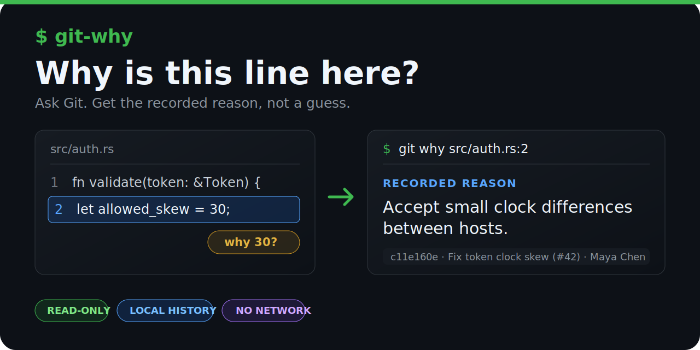

<div align="center">
  

  [](https://github.com/whatnotbot/git-why/actions/workflows/ci.yml)
  [](LICENSE)
</div>

`git-why` reads local Git history for one line of code. It prints the commit that last changed the line, earlier line-history commits, and issue references found in commit messages.

```console
$ git why src/auth.rs:2
src/auth.rs:2 at c11e160ef884305ed4fd8f1b3744d7e1e7d00817
        let allowed_skew = 30;

RECORDED REASON
    Accept small clock differences between hosts.

EVIDENCE
    LAST CHANGED  c11e160e  2026-01-02T03:04:05Z  Maya Chen
      Fix token clock skew (#42)
      Reference #42

History: complete
```

`RECORDED REASON` comes from the commit body or subject. When neither contains a useful explanation, the command prints `NO RECORDED REASON`. It does not infer an explanation from the code.

## Install

Git 2.15 and Rust 1.85 or newer are required. Install from GitHub over HTTPS:

```console
cargo install --git https://github.com/whatnotbot/git-why --locked
```

If your GitHub account is configured for SSH, clone first and install from the checkout:

```console
git clone git@github.com:whatnotbot/git-why.git
cd git-why
cargo install --path . --locked
```

Cargo installs an executable named `git-why`. Git dispatches external subcommands by filename, so both forms run the same program:

```console
git why src/auth.rs:2
git-why src/auth.rs:2
```

To build without installing:

```console
cargo build --release --locked
./target/release/git-why --version
```

## Usage

```text
Show the recorded evidence behind a line of code

Usage: git-why [OPTIONS] <FILE:LINE>

Arguments:
  <FILE:LINE>  File and line to explain, for example src/auth.rs:42

Options:
      --json     Emit the report as JSON
  -h, --help     Print help
  -V, --version  Print version
```

Run the command anywhere inside a worktree. Relative paths start at the current directory. Absolute paths must point inside the same repository.

```console
git why src/auth.rs:42
git why ../src/auth.rs:42
git why --json src/auth.rs:42
```

The target must be a tracked file at `HEAD`. Line numbers start at 1.

## JSON output

`--json` writes one JSON document to standard output. Errors go to standard error.

```console
$ git why --json src/auth.rs:2
{
  "schema_version": 1,
  "target": {
    "path": "src/auth.rs",
    "revision": "c11e160ef884305ed4fd8f1b3744d7e1e7d00817",
    "line": 2,
    "text": "    let allowed_skew = 30;",
    "dirty": false
  },
  "reason": {
    "status": "recorded",
    "text": "Accept small clock differences between hosts.",
    "source_commit": "c11e160ef884305ed4fd8f1b3744d7e1e7d00817"
  },
  "evidence": [
    {
      "relation": "last_changed",
      "commit": "c11e160ef884305ed4fd8f1b3744d7e1e7d00817",
      "authored_at": "2026-01-02T03:04:05Z",
      "author_name": "Maya Chen",
      "subject": "Fix token clock skew (#42)",
      "body": "Accept small clock differences between hosts.",
      "references": [
        {
          "number": 42,
          "url": null
        }
      ]
    }
  ],
  "history_complete": true,
  "warnings": []
}
```

The example repository has no remote, so the reference URL is `null`. With an origin such as `git@github.com:acme/widgets.git`, reference `#42` gets the local URL `https://github.com/acme/widgets/issues/42`. No GitHub request is made.

## Data access

The program runs Git commands against the current repository. Child Git processes have credential prompts, lazy object fetching, external diffs, text conversion, and configured file-system monitors disabled. The program does not make HTTP requests or write to the repository.

Working-tree changes are excluded from the evidence. When the target file is dirty, the report uses the line from `HEAD` and includes a warning.

Human output replaces terminal control and bidirectional formatting characters. JSON strings are escaped by `serde_json`.

## Limits

- One line can be inspected per command. Ranges and symbol lookup are unsupported.
- Files must be tracked UTF-8 text at `HEAD`. Symbolic links are rejected.
- Source files are limited to 5 MiB. Commit metadata is limited to 1 MiB.
- A report contains at most six distinct evidence commits.
- The command does not fetch missing objects. Shallow, partial, truncated, and file-history fallback results are marked incomplete.
- A recorded commit message may itself be incomplete or incorrect.
- GitHub links are constructed from the `origin` URL and `#number` text. Remote issue and pull-request data is not queried.

Exit status `0` means a report was produced. Operational failures return `1`; invalid command-line usage returns `2`.

## Development

[CONTRIBUTING.md](CONTRIBUTING.md) lists the local checks and pull-request expectations. Security reports belong in the private channel described in [SECURITY.md](SECURITY.md). Project conduct is covered by [CODE_OF_CONDUCT.md](CODE_OF_CONDUCT.md).

## License

MIT. See [LICENSE](LICENSE).
